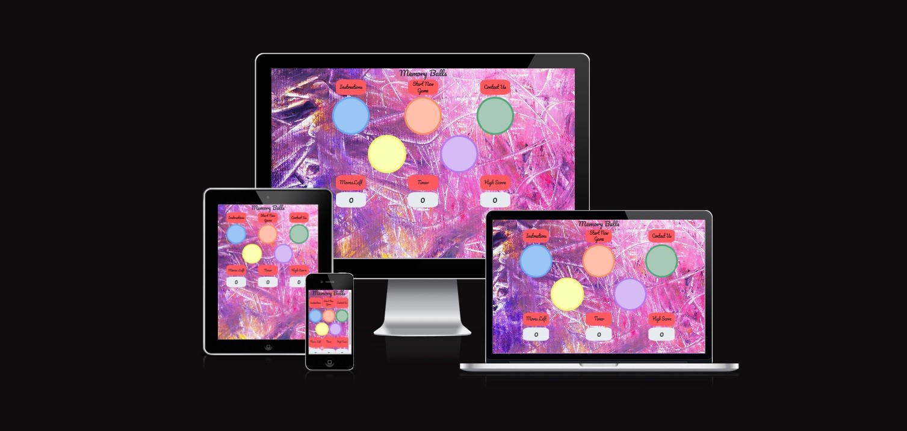
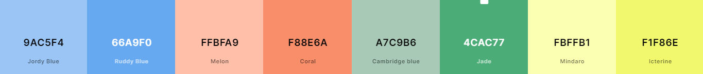
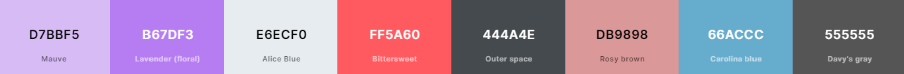
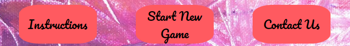
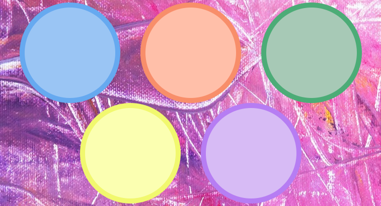
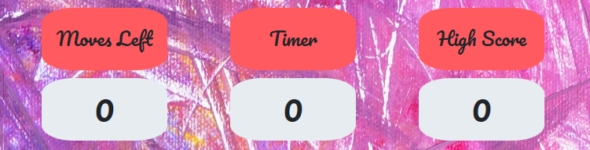
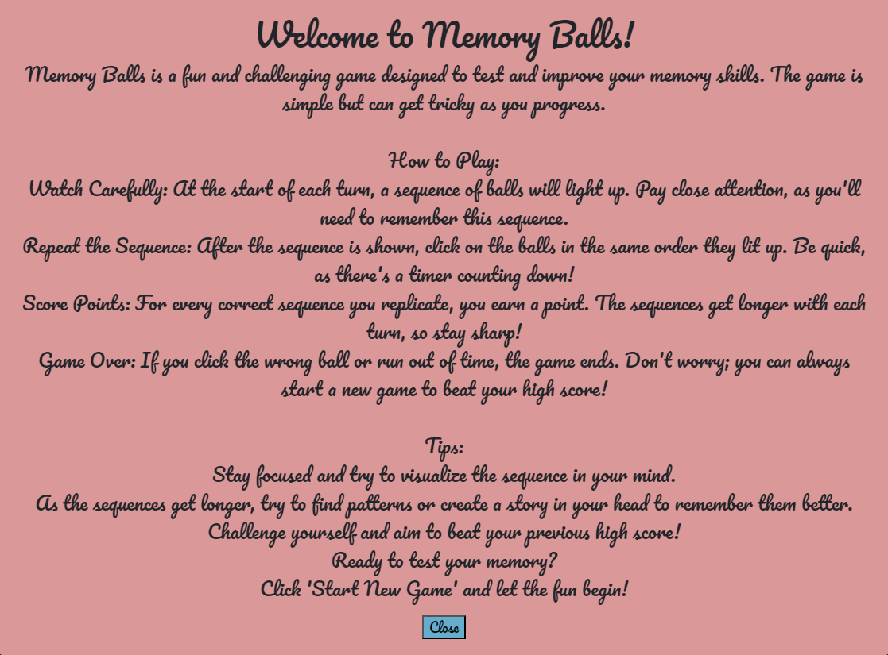
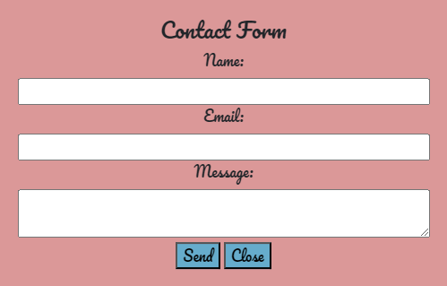
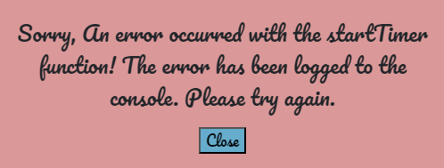
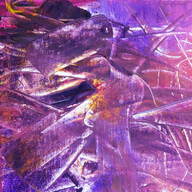

<h1 align="center">Memory Balls Game README.md</h1>

<h2 align="center"></h2>

[Link to live site here.](https://sleighton-dot-com.github.io/Memory-Game/)

---

* # Description

Memory Balls is a fun and challenging game designed to test and improve your memory skills. The game is simple but can get tricky as you progress. The objective is to remember the sequence in which the balls light up and then replicate that sequence.

* ### How to Play

  * Watch Carefully: At the start of each turn, a sequence of balls will light up. Pay close attention, as you'll need to remember this sequence.  
  * Repeat the Sequence: After the sequence is shown, click on the balls in the same order they lit up. Be quick, as there's a timer counting down!  
  * Score Points: For every correct sequence you replicate, you earn a point. The sequences get longer with each turn, so stay sharp!  
  * Game Over: If you click the wrong ball or run out of time, the game ends. Don't worry; you can always start a new game to beat your high score!

 * ### Tips

    * Stay focused and try to visualize the sequence in your mind.  
    * As the sequences get longer, try to find patterns or create a story in your head to remember them better.  
    * Challenge yourself and aim to beat your previous high score!

---

* # User Experience (UX)

* ### User Goals

    1. As a user I want the game to be simple to start.
    2. As a user I want to be able to read the instructions for the game before starting.
    3. As a user I want the game to have a simple layout for easy playing.
    4. As a user I want to be able to provide feedback to the developers.

* ### Developer Goals

    1. As a Developer i want to grab the users attention from the start.
    2. As a Developer I want to create a simple and easy game for long playtime.
    3. As a Developer I want to maintain the users attention with interaction and sounds.

* ## Design

* ### Color Scheme

  * The aim of the colour scheme for this project was to be sutble but still colourful enough to catch the users eye.

* ### Fonts

  * Pacifico is the primary font used on this project with sans-serif used as a fallback.

* ### Background

  * The background was sourced from [Unsplash](https://unsplash.com/photos/Z7n-qSootxg).

--Wireframes

--Flowchart

---

* ## Features

* Instructions, new game and contact us buttons. 

* Five different colored balls to interact with. 

* Score, moves left and timer display. 

* Instructions modal for new players. 

* Contact form for user feedback. 

* Error modal for handling unexpected issues. 

* Audio feedback for user interactions.
* Favicon icons for more pleasing tabs. 

* Responsive on various device sizes down to a screen width of 255px for game availability on a wide variety of devices.
  
  ---

* # Technologies Used

* ## Languages
* [HTML 5](https://en.wikipedia.org/wiki/HTML5)
* [CSS 3](https://en.wikipedia.org/wiki/Cascading_Style_Sheets)
* [Javascript](https://en.wikipedia.org/wiki/JavaScript)

* ## Frameworks
* [Bootstrap v4.6.2](https://getbootstrap.com/docs/4.6/getting-started/introduction/)

* ## Websites & Programs Used
* [Google Fonts:](https://fonts.google.com/)
Google fonts were used to import the 'Pacifico' font into the style.css file which is used on all pages throughout the project.
* [Git:](https://git-scm.com/)
Git was used for version control by utilizing the Gitpod terminal to commit to Git and Push to GitHub.
* [GitHub:](https://github.com/)
GitHub is used to store the project's code after being pushed from Git.
* [CodeAnywhere:](https://app.codeanywhere.com/)
CodeAnywhere was used as the IDE platform for website development.
* [Lucidchart:](https://www.lucidchart.com/pages/)
Lucidchart was to develop the flowchart for this game.

* [Balsamiq:](https://balsamiq.com/)
Balsamiq was used to create the wireframes during the design process.
* [Favicon Generator:](https://www.favicon-generator.org/)
Favicon Generator was used to create the Favicons for the project.
* [Unsplash:](https://unsplash.com/)
Unsplash is where I sourced the background image.

* [zapsplat:](https://www.zapsplat.com/)
Zapsplat is where I sourced the sounds for this game.
* [Am I Responsive?:](https://ui.dev/amiresponsive?url=https://sleighton-dot-com.github.io/Memory-Game/)
This is where I tested the responsiveness for a few different screen sizes.
* [PythonTutor:](https://pythontutor.com/javascript.html#mode=edit)
Python Tutor is where I developed some of my Javascript functions.
* [Google Chrome Lighthouse:](https://developer.chrome.com/docs/lighthouse/overview/)
I used Lighthouse to check my page for SEO, performance and best practices.
