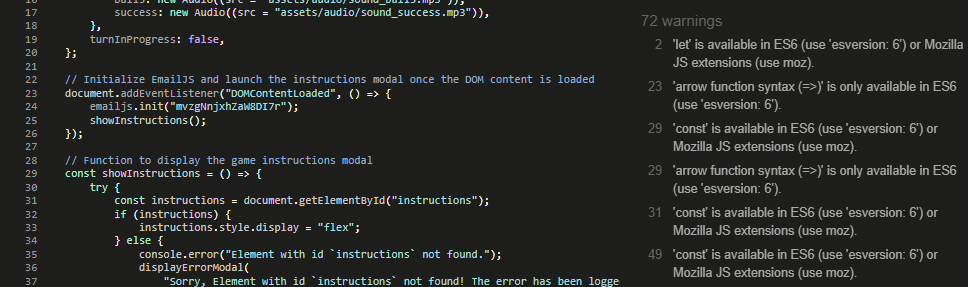

# Memory Balls Game README.md

[Link to live site here.](https://sleighton-dot-com.github.io/Memory-Game/)

---

* # Description

Memory Balls is a fun and challenging game designed to test and improve your memory skills. The game is simple but can get tricky as you progress. The objective is to remember the sequence in which the balls light up and then replicate that sequence.

* ### How to Play

  * Watch Carefully: At the start of each turn, a sequence of balls will light up. Pay close attention, as you'll need to remember this sequence.

  * Repeat the Sequence: After the sequence is shown, click on the balls in the same order they lit up. Be quick, as there's a timer counting down!
  
  * Score Points: For every correct sequence you replicate, you earn a point. The sequences get longer with each turn, so stay sharp!
  
  * Game Over: If you click the wrong ball or run out of time, the game ends. Don't worry; you can always start a new game to beat your high score!

* ### Tips

  * Stay focused and try to visualize the sequence in your mind.
  
  * As the sequences get longer, try to find patterns or create a story in your head to remember them better.
  
  * Challenge yourself and aim to beat your previous high score!

---

* # User Experience (UX)

* ### User Goals

    1. As a user I want the game to be simple to start.
    2. As a user I want to be able to read the instructions for the game before starting.
    3. As a user I want the game to have a simple layout for easy playing.
    4. As a user I want to be able to provide feedback to the developers.

* ### Developer Goals

    1. As a Developer I want to grab the user's attention from the start.
    2. As a Developer I want to create a simple and easy game for long playtime.
    3. As a Developer I want to maintain the user's attention with interaction and sounds.

* ## Design

* ### Color Scheme

  * The colour scheme for this project aimed to be subtle but still colourful enough to catch the user's eye.

* ### Fonts

  * Pacifico is the primary font used on this project with sans-serif used as a fallback.

* ### Background

  * The background was sourced from [Unsplash](https://unsplash.com/photos/Z7n-qSootxg).

* ### Audio Files

  * The audio files were sourced from [zapsplat](https://www.zapsplat.com/).

* ### Wireframe

  

---

* ## Features

* Instructions, new game and contact us buttons.\

* Five different coloured balls to interact with.\

* Score, moves left and timer display.\

* Instructions modal for new players.\

* Contact form for user feedback.\

* Error modal for handling unexpected issues.\

* Audio feedback for user interactions.
* Favicon icons for more pleasing tabs.\

* Responsive on various device sizes down to a screen width of 255px for game availability on a wide variety of devices.
  
---

* # Testing
  
* When beginning a new project there are two main ways to test it.
  
  * Automated testing entails running tests on a system to ensure that it operates properly without the need for human intervention using software tools and scripts. The "Red, Green, Refactor" rule is a fundamental tenet of automated testing, particularly in Test-Driven Development (TDD). According to this guideline, developers must first create a test that fails (Red), then write the bare minimum of code necessary to pass the test (Green), and finally rewrite the code for clarity and optimisation while ensuring the test still passes (rewrite). This cycle makes sure that the program is regularly tested and enhanced, resulting in code that is solid and easy to maintain. Modern development pipelines rely heavily on automated tests because of their repeatability, speed, and consistency in giving quick feedback and guaranteeing constant code quality throughout the development lifecycle.
  
  * Manual testing involves human testers carefully interacting with a piece of software to find flaws and assess its features. Manual testing, as opposed to automated testing, is based on human experience, intuition, and comprehension of the user's point of view. To browse the software and make sure it operates as expected, testers may utilise exploratory techniques or test cases. This strategy is particularly beneficial for usability testing, which evaluates the user experience and intuitiveness of the interface. Manual testing gives exceptional flexibility and the capacity to capture nuanced input that machines might ignore, despite being slower and less reliable than automated procedures.

* At the beginning of this project I intended to use Test driven development but as I began to modify the code I decided on manual testing and removed the relevant files from the project.

* ## Validation

  The W3C Markup Validator and W3C CSS Validator Services were used to validate the project to ensure there were no syntax errors in the project. CSS has been auto-prefixed with Autoprefixer CSS online. Each page was assessed through Web Accessibility Evaluation Tool for any errors and Lighthouse on the Google Chrome Dev Tools for accessibility, performance and best practices. I also used JSHint to check the Javascript for any errors.

  * [W3C Markup Validator](https://jigsaw.w3.org/css-validator/#validate_by_input)
  * [W3C CSS Validator](https://jigsaw.w3.org/css-validator/#validate_by_input)
  * [Auto-Prefixer](https://autoprefixer.github.io/)
  * [Web Accessibility Evaluation Tool](https://wave.webaim.org/)
  * [JSHint](https://jshint.com/)
  * [Google Chrome Lighthouse](https://developer.chrome.com/docs/lighthouse/overview/)

* ## General Testing

* The Website was tested on Google Chrome, Microsoft Edge, Mozilla Firefox, Apple Safari and Opera browsers at various screen widths, all relating to certain viewing devices.
* The website was viewed on a Desktop, Android Tablet & Android Phone as part of my testing.
* I asked friends to view the project on Apple products and let me know how it looked and to try all links across the site.
* Javascript functions were passed through [PythonTutor](https://pythontutor.com/javascript.html#mode=edit) to check that they worked correctly.

* ### Displaying and Responsive

|  Screen size | Device  | Chrome | Edge| Firefox | Opera | Safari |
| :-----------: | :---: | :---: | :---: | :---: | :---: | :---: |
| 360px | Galaxy S8+ | &check; | &check; | &check; | &check; | &check; |
| 393px | Pixel 5 | &check; | &check; | &check; | &check; | &check; |
| 414px | iPhone XR | &check; | &check; | &check; | &check; | &check; |
| 540px | Surface Duo | &check; | &check; | &check; | &check; | &check; |
| 667px | iPhone SE (landscape) | &check; | &check; | &check; | &check; | &check; |
| 768px | iPad Mini | &check; | &check; | &check; | &check; | &check; |
| 820px | iPad Air | &check; | &check; | &check; | &check; | &check; |
| 912px | Surface Pro 7 | &check; | &check; | &check; | &check; | &check; |
| 1024px | iPad Mini (landscape) | &check; | &check; | &check; | &check; | &check; |
| 1280px | Laptop/Desktop | &check; | &check; | &check; | &check; | &check; |
| 1920px | HD Laptop/Desktop | &check; | &check; | &check; | &check; | &check; |

* ### W3C Markup Validator

The W3C Markup Validator returned on warning referring to the H1 heading tag on the instructions modal. I left this as a H1 tag as this is the title of the modal.

* ### W3C CSS Validator

W3C CSS Validator found no errors.

* ### Web Accessibility Evaluation Tool

Web Accessibility Evaluation Tool found no errors.\

* ### JSHint

JSHint online found 72 warnings, but I believe this is due to it needing to be installed and configured to remove these warnings.\

* ### Chrome Lighthouse

| Navigation | Desktop | Mobile |
|:----------:|:----------:|:----------:|
| Performance |    100     |    98     |
| Accessibility |    100     |    100     |
| SEO |    100     |    100     |
| Best Practices |    100     |    100     |

* ### Fixed Bugs

  * I had an issue with a console error getting logged:

        Uncaught TypeError: Cannot read properties of null (reading 'classList')
         at highlightBall (game.js:41:34)
        at game.js:50:9

    I solved this by removing `data-listener="false"` from the index.html page and adding the following code to the newGame() function in Javascript:

            {
         if (!ball.hasAttribute("data-listener")) {
            ballClicked(ball);
            }   
        }

  * I had an issue with the game balls still being able to be clicked when the player's turn had ended either by time running out or a wrong move being made. I solved this by adding the following code to the playerTurn():

        game.turnInProgress = true;

  * I had a few console errors being logged that referenced the Favicon manifest file and its inability to find "android-icon-144x144.png", I solved this by removing the link to the manifest file.

  * When the contact modal is closed via the close button it logs 3 errors to the console.

         An invalid form control with name='name' is not focusable. <textarea id=​"message" name=​"message" required>​</textarea>
         An invalid form control with name='email' is not focusable. <textarea id=​"message" name=​"message" required>​</textarea>​
         An invalid form control with name='message' is not focusable. <textarea id=​"message" name=​"message" required>​</textarea>​​

    I found a solution on [StackOverflow](https://stackoverflow.com/questions/22148080/an-invalid-form-control-with-name-is-not-focusable) to add type="button" to the close button.

* ### Known Bugs

  * The required attribute within the contact form inputs doesn't seem to work, this allows the form to be submitted blank. The form is still actioned through EmailJS but without content.

  * During mobile testing I had a report that the game froze on an Android mobile phone. Neither the user nor I could replicate this issue.

  * I am getting yellow warnings in the console of the deployed site. I am unsure what this means as the code it specifies is not code I have written.
  
        pagedata-script.js:1 CaptureThumbnail error TypeError: a.getContext(...).drawWindow is not a function
        at pagedata-script.js:1:12510
        at pagedata-script.js:1:12723
        at pagedata-script.js:1:13055
        at pagedata-script.js:1:13059

---

* # Deployment

* ### GitHub Pages

    The project was deployed to GitHub Pages using the following steps...

    1. Locate the [GitHub repository](https://github.com/SLeighton-dot-com/GYM-Website) you want to deploy.
    2. Go to your repository's "Settings" tab.
    3. Scroll down to the "GitHub Pages" section.
    4. Under the "Source" heading, select the "Main" branch.
    5. Choose the folder where your website files are located, this would be the "root" directory.
    6. Click "Save" or "Save and Continue."
    7. Wait for deployment: GitHub Pages will automatically build and deploy your website. It may take a few minutes. Once the process is complete, you'll see a green checkmark and a URL where your website is published.

        Verify the deployment: Open the provided URL in your browser to verify that your website is deployed correctly. It may take some time for the changes to propagate.

* ### Forking the GitHub Repository

    By forking the GitHub Repository we make a copy of the original repository on our GitHub account to view and/or make changes without affecting the original repository by using the following steps...

    1. Locate the [GitHub repository](https://github.com/SLeighton-dot-com/GYM-Website) you want to fork. You can search for it using the search bar at the top of the GitHub page, or you can navigate to it directly if you know the URL.
    2. On the repository page, you'll see a button with the label "Fork" in the top right corner of the page. Click on the "Fork" button.
    3. GitHub will prompt you to choose the location where you want to fork the repository. This will create a copy of the repository under your GitHub account.
    4. GitHub will start the forking process, which may take a few moments.

* ### Making a Local Clone

    1. Log in to GitHub and locate the [GitHub Repository](https://github.com/SLeighton-dot-com/GYM-Website)
    2. On the repository page, click on the green "Code" button. A drop-down menu will appear with the repository URL. You can click on the clipboard icon to copy the URL.
    3. Open Git Bash.
    4. Use the cd command in the terminal to navigate to the directory where you want to clone the repository and press enter.
    5. Next type `git clone`, and then paste the URL you copied in Step 2.

            git clone https://github.com/SLeighton-dot-com/GYM-Website

    6. Press Enter. Your local clone will be created.

---

* # Technologies Used

* ## Languages

* [HTML 5](https://en.wikipedia.org/wiki/HTML5)
* [CSS 3](https://en.wikipedia.org/wiki/Cascading_Style_Sheets)
* [Javascript](https://en.wikipedia.org/wiki/JavaScript)

* ## Frameworks

* [Bootstrap v4.6.2](https://getbootstrap.com/docs/4.6/getting-started/introduction/)

* ## Websites & Programs Used

* [Google Fonts:](https://fonts.google.com/)
Google fonts were used to import the 'Pacifico' font into the style.css file which is used on all pages throughout the project.
* [Git:](https://git-scm.com/)
Git was used for version control by utilizing the Gitpod terminal to commit to Git and Push to GitHub.
* [GitHub:](https://github.com/)
GitHub is used to store the project's code after being pushed from Git.
* [CodeAnywhere:](https://app.codeanywhere.com/)
CodeAnywhere was used as the IDE platform for website development.
* [Coolors:](https://coolors.co/) I used Coolors to generate color palettes.
* [Balsamiq:](https://balsamiq.com/)
Balsamiq was used to create the wireframes during the design process.
* [Favicon Generator:](https://www.favicon-generator.org/)
Favicon Generator was used to create the Favicons for the project.
* [Unsplash:](https://unsplash.com/)
Unsplash is where I sourced the background image.
* [zapsplat:](https://www.zapsplat.com/)
Zapsplat is where I sourced the sounds for this game.
* [Am I Responsive?:](https://ui.dev/amiresponsive?url=https://sleighton-dot-com.github.io/Memory-Game/)
This is where I tested the responsiveness for a few different screen sizes.
* [PythonTutor:](https://pythontutor.com/javascript.html#mode=edit)
Python Tutor is where I developed some of my Javascript functions.

---

* # Acknowledgements and Credits

* My Mentor Rory Patrick for helpful feedback and advice during mentor sessions throughout this project.

* The Tutor support team at Code Institute for their support and guidance.

* [W3 Schools](https://www.w3schools.com/js/js_errors.asp)
 for the tutorial on "Try and Catch" error handling.

* [StackOverflow](https://stackoverflow.com/questions/22148080/an-invalid-form-control-with-name-is-not-focusable) for the assistance on my close button console errors.
